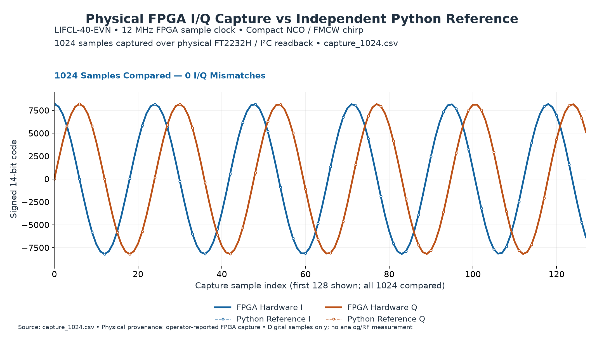
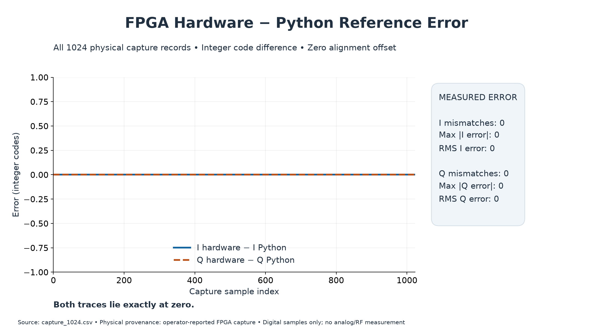

# open-rf-ip

Vendor-independent SystemVerilog soft IP for FPGA-based RF waveform generation and FMCW chirps, verified against independent Python reference models and physically validated on an LIFCL-40-EVN FPGA.

## Overview

A compact digital waveform engine with a phase-continuous NCO, programmable linear chirp controller, and exact integer verification. The reusable RTL uses no vendor primitives or proprietary IP.

## Architecture

```text
Start word + signed step + length + repeat
                   │
             Chirp controller
                   │ 32-bit tuning word
             Phase accumulator
                   │ 10-bit phase address
         Shared sine LUT (two reads)
                   │
           Signed 14-bit I/Q
         valid / chirp_start / chirp_end
```

The compact configuration uses a 32-bit accumulator and a 1024-entry sine table. I and Q share one table with a quarter-cycle address offset. Reset, pause, one-shot, repeat, up/down chirps, and phase continuity have explicit contracts. See [architecture](docs/architecture.md).

## Current status

**Milestone 4 — PHYSICAL FPGA DIGITAL WAVEFORM VALIDATION: BIT-EXACT PASS.**

- SRAM programming, static LEDs, native 12 MHz clock, and chirp liveness physically validated.
- 1024 physical FPGA I/Q samples captured in RAM and read through FT2232H channel-B I²C.
- All 1024 I, Q, valid, chirp_start, and chirp_end values exactly match the independent Python reference.
- Zero alignment shift; maximum and RMS I/Q error are zero; raw binary and CSV agree.

## Verification

Independent mathematical models, pytest, cocotb/Verilator sample comparisons, lint, Yosys synthesis, and nextpnr-nexus implementation provide complementary checks. Plots illustrate the measured result; exact comparisons determine acceptance. See [verification](docs/verification.md).



## Physical FPGA validation

The captured waveform is the first 1024 valid samples of a 10000-sample one-shot chirp, nominally 500 kHz to 2 MHz at a 12 MHz clock. The capture starts on `valid && chirp_start`. Physical operation was observed by the operator; the saved files were independently analyzed offline.



The [physical validation record](docs/physical_validation.md) documents the configuration, alignment, packing, and scope. A small immutable [CSV and raw binary example](examples/physical_capture/README.md) is included for reproducibility.

## Repository structure

| Directory | Contents |
| --- | --- |
| `rtl/` | Portable compact NCO and chirp RTL, generated LUT source |
| `models/python/` | Independent numerical and cycle reference models |
| `verification/` | Python and cocotb regression tests |
| `fpga/lifcl40/` | Board wrappers, constraints, build/audit scripts, capture/readback |
| `analysis/`, `scripts/` | Offline comparisons, plots, LUT generation, synthesis |
| `docs/` | Public contracts, verification documentation, curated figures |
| `examples/physical_capture/` | One physical capture with provenance and hashes |

## Quick start

From the repository root, with Python installed:

```sh
python3 -m venv .venv
.venv/bin/python -m pip install -r requirements-dev.txt
.venv/bin/python -m pytest -q verification/pytest/test_nco.py verification/pytest/test_nco_lut.py verification/pytest/test_chirp.py fpga/lifcl40/capture/test_format.py analysis/test_hardware_verification.py
.venv/bin/python analysis/plot_hardware_verification.py
```

The final command needs no FPGA connection. It checks the included physical capture and writes comparison CSV/JSON and PNGs under ignored `reports/hardware_verification/`. To reproduce the time/frequency plot, then run:

```sh
.venv/bin/python analysis/plot_captured_chirp_frequency.py
```

RTL simulation additionally requires Verilator, make, and a C++ compiler. [Verification instructions](docs/verification.md) cover RTL, lint, synthesis, and offline board builds. Programming and physical readback are separate manual actions.

## Supported / validated hardware

Lattice LIFCL-40-EVN / CrossLink-NX, implementation target **LIFCL-40-9BG400C**, using its native 12 MHz clock. Board-specific code stays under `fpga/lifcl40/`; other targets require their own implementation and validation.

## Limitations

This is **digital FPGA validation only**. It does not establish analog DAC performance, RF phase noise, GHz analog output, or 400 MHz physical RF bandwidth. The physical exact-match result covers a 1024-sample prefix, not an entire chirp or every programmable configuration. Routed timing estimates are not measured maximum hardware clock rates. ADCs, DACs, and analog/RF circuitry are outside this repository.

## Roadmap

Preserve the physically validated compact mode. A selectable high-purity mode and its user-supervised physical validation belong to later releases. Parallel sample generation and wider digital bandwidth require separate architecture, verification, and implementation work.
