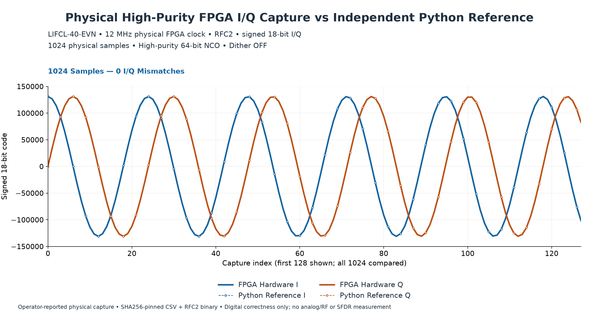
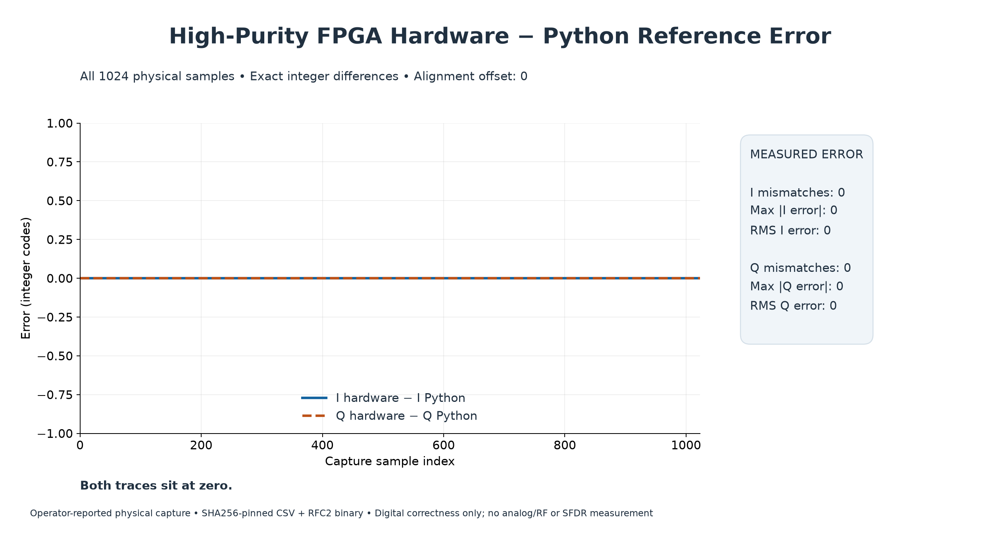

`open-rf-ip` is a reusable digital RF waveform engine built around a phase-continuous **Numerically Controlled Oscillator (NCO)** and a programmable linear **FMCW chirp controller**, with selectable compact and high-purity implementations.

The RTL is written in portable SystemVerilog with no vendor primitives or proprietary IP dependencies. Verification uses independent Python models, pytest/cocotb simulation, bit-exact sample comparison, Verilator lint, Yosys synthesis, and open-source FPGA implementation tools.

Both the compact and high-purity implementations have been physically validated on an LIFCL-40-EVN FPGA. Each validation includes direct capture of 1,024 hardware-generated I/Q samples and exact comparison against an independent Python reference model with zero I/Q/control mismatches and zero alignment offset.

The project is intended as an open foundation for experimentation with FPGA-based RF signal generation, radar waveform synthesis, spectral-purity optimization, arbitrary waveform generation, and future parallel high-bandwidth architectures.# open-rf-ip

Open-source, vendor-independent **SystemVerilog soft IP for FPGA-based RF waveform generation, DDS/NCO signal synthesis, and FMCW chirp generation**. The project is verified against independent Python reference models and physically validated on a Lattice CrossLink-NX LIFCL-40-EVN FPGA.

## Overview

`open-rf-ip` is a reusable digital RF waveform engine built around a phase-continuous **Numerically Controlled Oscillator (NCO)** and a programmable linear **FMCW chirp controller**, with selectable compact and high-purity implementations.

The RTL is written in portable SystemVerilog with no vendor primitives or proprietary IP dependencies. Verification uses independent Python models, pytest/cocotb simulation, bit-exact sample comparison, Verilator lint, Yosys synthesis, and open-source FPGA implementation tools.

Both the compact and high-purity implementations have been physically validated on an LIFCL-40-EVN FPGA. Each validation includes direct capture of 1,024 hardware-generated I/Q samples and exact comparison against an independent Python reference model with zero I/Q/control mismatches and zero alignment offset.

The project is intended as an open foundation for experimentation with FPGA-based RF signal generation, radar waveform synthesis, spectral-purity optimization, arbitrary waveform generation, and future parallel high-bandwidth architectures.

## Architecture

| Production mode | Compact | High-purity |
| --- | --- | --- |
| Phase accumulator | 32 bits | 64 bits |
| Effective phase resolution | 10 bits | 16 bits |
| Signed I/Q | 14 bits | 18 bits |
| Shared dual-read ROM | Full-wave 1024 × 14 | Quarter-wave 16384 × 17 |
| NCO active-edge latency | 1 | 2 |
| Physical samples compared | 1024 | 1024 |
| Independent Python comparison | Bit-exact | Bit-exact |

Compact mode remains available with its validated numerical and timing behavior and small resource footprint. Select high-purity mode with `HIGH_PURITY=1` on `rf_nco_mode` or `rf_chirp_nco_mode` at elaboration. Both are vendor-independent, deterministic, and dither-off. See the [compact architecture](docs/architecture.md) and [high-purity architecture and latency contract](docs/high_purity_nco.md).

## Current status

**Milestone 5 / 5A — PHYSICAL HIGH-PURITY FPGA DIGITAL WAVEFORM VALIDATION: BIT-EXACT PASS.**

Both modes have been physically validated on LIFCL-40-EVN / CrossLink-NX. Each captured 1024 physical FPGA samples and matched an independent Python reference exactly: zero I, Q, valid, chirp_start, or chirp_end mismatches, zero alignment offset, and zero maximum/RMS I/Q error. Original raw binary and decoded CSV agree exactly.

High-purity achieved **>90 dBc numerical digital SFDR** (worst 92.407 dBc) in the documented 72-tone coherent study. Production NCO and chirp harnesses meet a 100 MHz routed timing constraint. Physical readback uses the board's native 12 MHz clock; its capture wrapper has a separate timing result. These are digital results, not measured analog/RF SFDR.

## Verification

Independent mathematical models, pytest, cocotb/Verilator sample comparisons, lint, Yosys synthesis, and nextpnr-nexus implementation provide complementary checks. Plots illustrate the measured result; exact comparisons determine acceptance. See [verification](docs/verification.md).



## Physical FPGA validation

The captured waveform is the first 1024 valid samples of a 10000-sample one-shot chirp, nominally 500 kHz to 2 MHz at a 12 MHz clock. The capture starts on `valid && chirp_start`. Physical operation was observed by the operator; the saved files were independently analyzed offline.



The [high-purity physical validation record](docs/high_purity_physical_validation.md) includes RFC2 evidence, hashes, exact-reference methodology, and offline reproduction. The compact [physical validation record](docs/physical_validation.md) documents the configuration, alignment, packing, and scope. A small immutable [CSV and raw binary example](examples/physical_capture/README.md) is included for reproducibility.

## Repository structure

| Directory | Contents |
| --- | --- |
| `rtl/` | Portable compact/high-purity NCO and chirp RTL, generated LUT source |
| `models/python/` | Independent numerical and cycle reference models |
| `verification/` | Python and cocotb regression tests |
| `fpga/lifcl40/` | Board wrappers, constraints, build/audit scripts, capture/readback |
| `analysis/`, `scripts/` | Offline comparisons, plots, LUT generation, synthesis |
| `docs/` | Public contracts, verification documentation, curated figures |
| `examples/physical_capture/` | Compact physical capture with provenance and hashes |
| `reports/hardware_capture/` | Selected immutable high-purity CSV/RFC2 evidence |
| `reports/high_purity_physical_verification/` | Selected public evidence manifest and comparison metadata |

## Quick start

From the repository root, with Python installed:

```sh
python3 -m venv .venv
.venv/bin/python -m pip install -r requirements-dev.txt
.venv/bin/python -m pytest -q verification/pytest/test_nco.py verification/pytest/test_nco_lut.py verification/pytest/test_chirp.py fpga/lifcl40/capture/test_format.py analysis/test_hardware_verification.py
.venv/bin/python analysis/plot_hardware_verification.py
```

For high-purity evidence, also run:

```sh
.venv/bin/python analysis/verify_high_purity_hardware.py
```

Both comparisons need no FPGA connection. The high-purity command writes derived artifacts under ignored `reports/high_purity_physical_verification/derived/`. The compact command checks the included physical capture and writes comparison CSV/JSON and PNGs under ignored `reports/hardware_verification/`. To reproduce the time/frequency plot, then run:

```sh
.venv/bin/python analysis/plot_captured_chirp_frequency.py
```

RTL simulation additionally requires Verilator, make, and a C++ compiler. [Verification instructions](docs/verification.md) cover RTL, lint, synthesis, and offline board builds. Programming and physical readback are separate manual actions.

## Supported / validated hardware

Lattice LIFCL-40-EVN / CrossLink-NX, implementation target **LIFCL-40-9BG400C**, using its native 12 MHz clock. Board-specific code stays under `fpga/lifcl40/`; other targets require their own implementation and validation.

## Limitations

This is **digital FPGA validation only**. It does not establish analog DAC performance, RF phase noise, GHz analog output, or 400 MHz physical RF bandwidth. The physical exact-match result covers a 1024-sample prefix, not an entire chirp or every programmable configuration. Routed timing estimates are not measured maximum hardware clock rates. ADCs, DACs, and analog/RF circuitry are outside this repository.

## Roadmap

Compact and selectable high-purity modes are physically validated. Parallel sample generation and wider digital bandwidth require separate architecture, verification, and implementation work.
