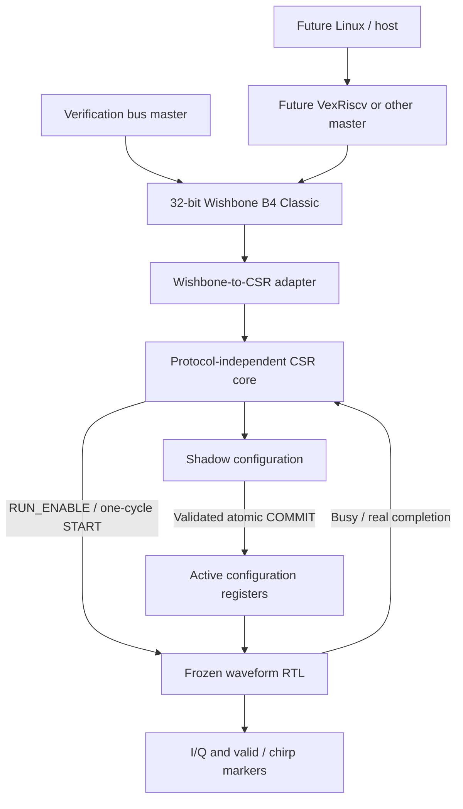

# CPU-independent waveform control plane — ABI 1.0

Software decides **what** waveform to generate. Dedicated RTL determines **every
sample and its timing**. Milestone 6.0/6.1 adds configuration and status around the
frozen compact and high-purity production waveform engines. No CPU is required.



## Architecture decision: stay with RV32

**WE STAY WITH RV32.** The future processor is a control processor, not a DSP
processor. Paired 32-bit shadow registers transfer genuine 64-bit tuning words;
a single COMMIT publishes the entire configuration atomically. RV64 is unnecessary
for this interface, allowing a small future VexRiscv integration. No VexRiscv source,
core generator, firmware, Linux implementation, or CPU-specific RTL is included.

`openrf_wb_slave` handles bus transactions only. `openrf_csr_core` handles state
and validation. `openrf_control` composes them. `openrf_controlled_nco` and
`openrf_controlled_chirp` instantiate the existing `rf_nco_mode` and
`rf_chirp_nco_mode` respectively, without duplicating their datapaths.

`HIGH_PURITY=0/1` remains an **elaboration-time** choice. Tone versus chirp is also
selected by the wrapper, with `ENGINE_KIND=0/1` in the CSR core. This deliberately
uses four separate compile-time test/implementation configurations rather than
instantiating two waveform engines to add a runtime mux. MODE validates the engine
actually compiled; unsupported modes fail COMMIT. All four builds share the ABI.
The original direct-control production modules remain available unchanged.

| Compiled profile | Accumulator / tuning word | Effective phase address | Signed I/Q | NCO latency |
|---|---|---|---|---|
| Compact | 32 bits | 10 bits | 14 bits | One enabled edge |
| High-purity | 64 bits | 16 bits, quarter-wave ROM | 18 bits | Two enabled edges |

See [high-purity architecture](high_purity_nco.md) and
[chirp architecture](chirp_architecture.md) for the frozen numerical contracts.
Control RTL contains no lookup values, waveform arithmetic, sample buffers,
processor-specific signals, or vendor primitives.

## Bus protocol and timing

The initial bus follows [Wishbone B4 Classic](https://cdn.opencores.org/downloads/wbspec_b4.pdf),
with 32-bit data and **16-bit byte addresses**, synchronous active-high reset,
and the signals `wb_clk_i`, `wb_rst_i`, `wb_cyc_i`, `wb_stb_i`, `wb_we_i`,
`wb_adr_i[15:0]`, `wb_dat_i[31:0]`, `wb_sel_i[3:0]`, `wb_dat_o[31:0]`,
`wb_ack_o`, and `wb_err_o`. The bus and waveform engine share one clock; there is
no CDC bridge. No pipelined mode, burst extension, retry, or external bus library.

| Rising edge | Adapter action | CSR/waveform effect |
|---|---|---|
| A | Capture request while CYC and STB are high | No CSR change |
| B | Execute captured request, register data and ACK or ERR | CSR state updates atomically here |
| C | Master samples ACK/ERR; response cleared | A successful START pulse is consumed by the engine here |
| D | Earliest next request capture | CYC may remain high across transactions |

Inputs must remain stable until the master samples termination at C. ACK and ERR
are mutually exclusive and are high only during the B→C response interval while
CYC/STB remain asserted. Holding the request through C does not execute it twice.
Reads return the **pre-B** register state; writes take effect at B. All read lanes
are returned regardless of SEL. All addresses must be aligned to four bytes.
Unmapped/reserved addresses, misalignment and writes to RO registers return ERR
and set `ILLEGAL_BUS_ACCESS`. Invalid reserved RUN_CONTROL writes do likewise.

Normal RW and shadow writes merge selected byte lanes. SEL=0 changes no bits;
a shadow write still marks DIRTY, conservatively treating every shadow write as
a configuration edit. Unselected reserved RUN_CONTROL bits are ignored. Command
writes require SEL=0xF. Semantic command rejection returns **ACK** and sticky error
bits, because the register access itself is legal; it performs no command subset.
COMMAND reads return zero. ERROR_STATUS is RO, not W1C.

Dropping CYC or STB before B cancels the captured request without side effects.
Dropping them after B suppresses the response but cannot undo an executed write.
Reset cancels in-flight transfers and clears all state. The master must not abort
an executed write and assume that it never happened.

## Protocol-independent request interface

The core consumes `req_i`, `we_i`, `addr_i[15:0]`, `wdata_i[31:0]`, and `sel_i[3:0]`.
`rdata_o` and `error_o` are combinational for that request; state changes at the
rising edge where `req_i=1`. Each asserted edge is a separate transaction, so an
adapter must issue one execution pulse per transfer. The Wishbone adapter registers
both request and response to separate external bus timing from register decoding.
A future AXI/APB/USB adapter can use this same interface without touching waveform
RTL. `engine_busy_i` must include pending output work; `engine_done_i` is a real
one-cycle completion event (or one event per repeated chirp).

## Register map

All offsets are bytes. `IP_ID=0x4F524649` identifies ORFI. ABI_VERSION is
`major[31:16]:minor[15:0]`, currently `0x00010000`. Undefined bits read zero except
shadow storage, which retains written reserved bits so COMMIT can reject them.

| Offset | Register | Access | Reset |
|---|---|---|---|
| 0x0000 | IP_ID | RO | 0x4F524649 |
| 0x0004 | ABI_VERSION | RO | 0x00010000 |
| 0x0008 | CAPABILITIES | RO | Compiled capability mask |
| 0x000C | SCRATCH | RW | 0x00000000 |
| 0x0010 | COMMAND | WO | 0x00000000 |
| 0x0014 | STATUS | RO | 0x00000000 |
| 0x0018 | ERROR_STATUS | RO | 0x00000000 |
| 0x001C | CONFIG_SEQUENCE | RO | 0x00000000 |
| 0x0020 | MODE | SHADOW | 0 tone / 1 chirp |
| 0x0024 | RUN_CONTROL | RW | 0x00000000 |
| 0x0028 | NCO_PHASE_INC_LO | SHADOW | 0x00000000 |
| 0x002C | NCO_PHASE_INC_HI | SHADOW | 0x00000000 |
| 0x0030 | CHIRP_START_LO | SHADOW | 0x00000000 |
| 0x0034 | CHIRP_START_HI | SHADOW | 0x00000000 |
| 0x0038 | CHIRP_STEP_LO | SHADOW | 0x00000000 |
| 0x003C | CHIRP_STEP_HI | SHADOW | 0x00000000 |
| 0x0040 | CHIRP_LENGTH | SHADOW | 0x00000000 |
| 0x0044 | CHIRP_CONFIG | SHADOW | 0x00000000 |
| 0x0048–0x007F | Reserved | ERR | — |

All other addresses through 0xFFFF also return ERR. `spec/control_registers.json`
is the address/bit-definition source of truth. The deterministic dependency-free
`generate_control_registers.py` generates the SV package and Python constants;
`--check` fails if either output is stale. Generated constants accompany the source.

| Register | Bit definitions / meaning |
|---|---|
| CAPABILITIES | 0 compact; 1 high-purity; 2 tone; 3 chirp; 4 repeat; 5 pause |
| SCRATCH | All 32 bits RW, diagnostics only |
| COMMAND | 0 COMMIT; 1 START; 2 CLEAR_STATUS; exactly one bit per full-word write |
| STATUS | 0 BUSY; 1 DONE_STICKY; 2 ERROR_STICKY; 3 CONFIG_DIRTY; 4 CONFIG_VALID; 5 RUN_ENABLE |
| ERROR_STATUS | Sticky error bitmask below; clear only with CLEAR_STATUS or reset |
| CONFIG_SEQUENCE | Number of successful commits, modulo 2^32 |
| MODE | 0 tone, 1 chirp; must equal compiled wrapper; all other values invalid |
| RUN_CONTROL | Bit 0 RUN_ENABLE immediate; selected reserved bits must be zero |
| NCO_PHASE_INC_LO/HI | Unsigned tuning word: bits 31:0 / 63:32 |
| CHIRP_START_LO/HI | Unsigned initial tuning word: bits 31:0 / 63:32 |
| CHIRP_STEP_LO/HI | Signed two's-complement step: bits 31:0 / 63:32 |
| CHIRP_LENGTH | Unsigned 32-bit length; must be nonzero in chirp builds |
| CHIRP_CONFIG | Bit 0 repeat; all other bits must be zero at COMMIT |

Capability masks are compact tone `0x25`, high-purity tone `0x26`, compact chirp
`0x39`, high-purity chirp `0x3A`. A chirp-only wrapper does not advertise a separate
fixed-tone engine, even though a zero-step chirp can produce a finite constant tone.

## Shadow, active and atomic COMMIT

Reset zeros active configuration, SCRATCH, sequence, errors, DONE, VALID, DIRTY,
and RUN_ENABLE. Shadow values reset to zero except MODE, which resets to the
compiled engine kind. Until a successful COMMIT, the wrapper prevents sample
progression even if software sets RUN_ENABLE.

Every shadow write updates only the selected shadow bytes and sets DIRTY. It does
not affect any active bit, output sample, phase, or timing. Reads of configuration
registers always return shadow values. Active readback registers are not part of
ABI 1.0; CONFIG_SEQUENCE/VALID/DIRTY track publication, and verification checks the
active outputs directly.

A successful COMMIT validates the **whole** shadow configuration, copies all
three 64-bit values, length and repeat on one edge B, sets VALID, clears DIRTY and
increments CONFIG_SEQUENCE. MODE is implicit in the fixed compiled wrapper and
must match it. Reserved CHIRP_CONFIG bits must be zero. In chirp builds length zero
fails configuration validation, preserving the original engine's no-start behavior.
Tone builds store but do not use chirp length. Unused parameter pairs are still
validated so malformed configurations cannot become silently truncated.

Compact unsigned NCO_PHASE_INC and CHIRP_START require HIGH=0. Compact signed
CHIRP_STEP requires HIGH=0xFFFFFFFF if LOW bit 31 is one, otherwise HIGH=0. Only
after these checks do wrappers select the low 32 bits. High-purity builds transfer
all 64 bits without narrowing. Signed steps and phase arithmetic remain modular,
with no frequency clamp, endpoint correction or STOP_FREQ register.

If busy or any validation fails, **no active bit, VALID or sequence changes**;
shadow and DIRTY remain intact, and all applicable error causes are latched.
COMMIT never resets waveform phase or flushes a pending NCO sample. Tone COMMIT
is rejected while RUN_ENABLE and VALID are both set; pause before committing a
new tone. High-purity tone pause retains a pending old sample, which resumes before
newly admitted samples, exactly following the production NCO pipeline.

## Commands, status and errors

COMMAND is an event, never a held level. Zero, multiple bits, reserved bits, or
partial-byte command writes produce BAD_COMMAND and perform nothing. START never
commits shadow values. START is supported only for chirp builds and requires VALID,
clean shadow, RUN_ENABLE=1, and no active/pending chirp. Disabled START is rejected,
not queued. Tone START is unsupported and sets BAD_COMMAND; tone operation uses
RUN_ENABLE directly. A rejected START may set multiple applicable error bits.

| Error bit | Name | Meaning |
|---|---|---|
| 0 | COMMIT_WHILE_BUSY | Active tone or unfinished/pending chirp blocks COMMIT |
| 1 | START_WHILE_BUSY | A previous chirp or start event is still active |
| 2 | START_WITH_DIRTY_CONFIG | Shadow was edited since the last successful COMMIT |
| 3 | START_WITHOUT_VALID_CONFIG | No active configuration has been committed |
| 4 | INVALID_CONFIGURATION | Unsupported mode, reserved config bits, chirp length zero or invalid compact extension |
| 5 | BAD_COMMAND | Unsupported/multiple/zero/reserved command or incomplete byte selection |
| 6 | ILLEGAL_BUS_ACCESS | Misaligned/unmapped address, RO write or selected reserved RUN_CONTROL bits |
| 7 | START_WHILE_DISABLED | START when RUN_ENABLE=0 |

All higher bits remain zero. CLEAR_STATUS is the sole non-reset clear mechanism:
it clears DONE and all errors without changing configuration, sequence, phase or
RUN_ENABLE. A real completion sampled on the clear edge wins and leaves DONE set.
Successful START and COMMIT do not implicitly clear sticky status. No DONE event
is fabricated for a tone. Repeated chirps set DONE on each real end marker.

## Waveform timing and pause

The adapter's B execution edge registers a one-cycle successful START pulse; the
existing chirp engine accepts it at C, called E0 below. From that edge the original
production timing is unchanged:

| Engine event | Compact | High-purity |
|---|---|---|
| E0 accepted start | No sample | No sample |
| E1 | Sample 0 / valid / start | Admit sample 0 into ROM stage |
| E2 | Sample 1 if length permits | Sample 0 / valid / start |
| Throughput while enabled | One sample/edge | One sample/edge |

RUN_ENABLE written at B affects the engine beginning at C. No extra sample
register or latency normalization is added. Turning it off holds phase/IQ and
clears valid/markers on subsequent disabled edges, retaining pending high-purity
samples and markers. Turning it on resumes exact phase continuity. DIRTY does
not pause or otherwise modify an already-running waveform. The bus continues to
operate while the engine is paused.

The production high-purity scheduler may drop busy before its last output drains.
The control wrapper tracks an accepted chirp until the real final valid/end event
is sampled on the following edge. STATUS.BUSY includes this interval and a pending
START pulse, so a paused final sample cannot be overwritten by COMMIT or another
START. This is a conservative control-status extension only; production I/Q,
valid and marker timing is untouched. Repeat remains busy until synchronous reset;
RUN_ENABLE pauses it, but there is no stop/abort command in ABI 1.0.

Tone BUSY means RUN_ENABLE && CONFIG_VALID. Tone first output occurs on the first
enabled engine edge for compact, second enabled edge for high-purity. Pausing does
not advance phase; bus traffic by itself does not clock-enable the waveform.

Example (chirp build, length/mode/step already valid, RUN_ENABLE=1, engine idle):

| Transaction | Execution edge | Active value / event |
|---|---|---|
| Write CHIRP_START_LO = 0xBBBBBBBB | B1 | Active remains previous value A |
| Write CHIRP_START_HI = 0xCCCCCCCC | B2 | Active remains A; DIRTY=1 |
| COMMIT | B3 | Active becomes 0xCCCCCCCCBBBBBBBB atomically; sequence increments |
| START | B4 | START pulse registered, uses active config only |
| Engine accepts START | B4+1 = E0 | No sample |
| First high-purity sample | E0+2 | Valid/start aligned to I/Q |

This example's full-width word requires the high-purity profile. HIGH-first then
LOW has identical atomicity. Compact values use the extension rules above.

## Future integration boundaries and scope

Wishbone/CSR is a **low-bandwidth control plane** for configuration, commands,
status and diagnostics. It is not a sample-data bus. A future VexRiscv master must
adapt its address convention to byte offsets, map the region, and honor the bus
handshake and commit protocol; the waveform RTL will not know a CPU exists.

Future long arbitrary-waveform playback would need a distinct high-throughput
host-transport → DMA/FIFO/memory → waveform-engine data path. None of that path,
amplitude scaling, burst/duty controls, DAC interfaces, external memory or PCIe
is designed or implemented here.

## Reproduction

```sh
.venv/bin/python scripts/generate_control_registers.py --check
.venv/bin/python -m pytest -q verification/pytest/test_control_register_map.py verification/pytest/test_control_plane_model.py verification/pytest/test_control_plane_rtl.py
.venv/bin/python fpga/lifcl40/control_plane/build.py
```

The build runs strict `--Wall` lint, memory-preserving generic Yosys synthesis,
LIFCL-40-9BG400C mapping and seed-1 routing at 100 MHz, then offline Oxide packing.
The feasibility harness uses a 55-bit input shift chain (plus one reset register)
and an output parity register so all runtime-programmable logic is retained with
only four package pins. The shift chain is synthetic stimulus, not a serial
protocol or host bridge. All four pins are explicitly constrained to known valid
package sites, but this is not a physical board hookup. Do not treat its generated
image as a board demonstration. No hardware access is part of these commands.
Full local results and limitations are recorded in `reports/milestone6_control_plane.md`.

## Milestone 6.0/6.1 measured validation

The new model/map/RTL suite passed **28 pytest cases**. Four standalone CSR
configurations verify the bus and atomic updates; four controlled waveform
configurations each compare at least **10,000 samples** against the existing
independent numerical models. Every cycle also checks valid, markers, and full
internal phase, including pauses and bus activity. All I/Q/control mismatches
are zero; no alignment search or numerical tolerance is used. The prior public
Milestone 4/5 offline suite passed **219 tests**, including saved physical evidence
comparisons. All 130 existing tracked files retain their pre-task SHA256 hashes.

LIFCL-40-9BG400C results below include the synthetic input/output harness. These
are routed seed-1 results with a 100 MHz constraint, not measured board frequency.

| Controlled build | COMB | FF | EBR | DSP | Routed Fmax (MHz) | 100 MHz slack (ns) |
|---|---:|---:|---:|---:|---:|---:|
| Compact tone | 892 | 576 | 1 | 0 | 159.490 | +3.730 |
| High-purity tone | 1254 | 687 | 16 | 0 | 125.707 | +2.045 |
| Compact chirp | 1176 | 807 | 1 | 0 | 143.534 | +3.033 |
| High-purity chirp | 1635 | 1048 | 16 | 0 | 127.356 | +2.148 |

Every build passes 100 MHz and therefore has positive internal setup margin at
12 MHz; 12 MHz was not separately routed. External I/O timing and a physical
control connection have not been validated. High-purity critical paths remain
in the existing ROM-to-I/Q output logic. The compact chirp's worst path is inside
the control block, from captured address to a shadow-register write enable; it still
meets 100 MHz. No bus decoder is inserted into the sample arithmetic path.

The unchanged Milestone 5 reference harnesses used constant waveform controls:
compact tone 50 COMB / 38 FF / 1 EBR / 195.351 MHz; high-purity tone 482 / 117 /
16 / 124.208 MHz; compact chirp 218 / 106 / 1 / 199.243 MHz; high-purity chirp
632 / 219 / 16 / 127.049 MHz. All used zero DSP. Relative changes are:

| Build | Delta COMB | Delta FF | Delta EBR / DSP | Delta Fmax (MHz) |
|---|---:|---:|---:|---:|
| Compact tone | +842 | +538 | 0 / 0 | -35.861 |
| High-purity tone | +772 | +570 | 0 / 0 | +1.499 |
| Compact chirp | +958 | +701 | 0 / 0 | -55.709 |
| High-purity chirp | +1003 | +829 | 0 / 0 | +0.307 |

These are whole-harness differences, **not isolated marginal CSR costs**. They
include new runtime-programmable operands that the constant-control baselines
could optimize away, as well as different harness registers and placement. The
control architecture adds request/response registers, nine 32-bit shadow words,
up to 225 active parameter bits, status/error/sequence storage, byte-write logic,
validation and read multiplexing. Synthesis removes unused active fields for each
compiled wrapper. Atomic 64-bit transfer uses parallel register enables, not a
64-bit processor or multiplier. Shadow storage maps to flip-flops, not EBR.
No future CPU resource estimate is included.

## Generic synthesis accounting

Memory-preserving Yosys synthesis (`synth -flatten -run begin:fine`) passed
`check -assert` in all six configurations. Counts below are technology-independent
word cells and register bits, not FPGA LUT counts. The control block retains all
active output ports here; integrated wrappers allow unused fields to optimize away.

| Generic top / HIGH_PURITY | Combinational word cells | Register bits | Logical memories | Multipliers |
|---|---:|---:|---|---:|
| openrf_control-0 | 147 | 704 | 0 | 0 |
| openrf_control-1 | 141 | 704 | 0 | 0 |
| openrf_controlled_nco-0 | 143 | 543 | 1024 x 14 ROM | 0 |
| openrf_controlled_nco-1 | 154 | 648 | 16384 x 17 ROM | 0 |
| openrf_controlled_chirp-0 | 189 | 774 | 1024 x 14 ROM | 0 |
| openrf_controlled_chirp-1 | 207 | 1009 | 16384 x 17 ROM | 0 |

Both standalone control profiles infer zero memories and zero multipliers. The
logical waveform ROM maps to 1 compact / 16 high-purity EBRs in target synthesis.
Strict Verilator `--Wall` lint passes with no warnings or suppression pragmas.
Yosys reports conversion of the shadow array to individual registers, which is
intentional for simultaneous atomic copy. ABC's combinational-network notice
comes from its combinational mapping stage; no sequential retiming is requested.

Validated tool versions: Verilator 5.032, Yosys 0.52 (fee39a3284),
nextpnr-nexus 0.11.1-31-g3edea68e, prjoxide 0.1.
