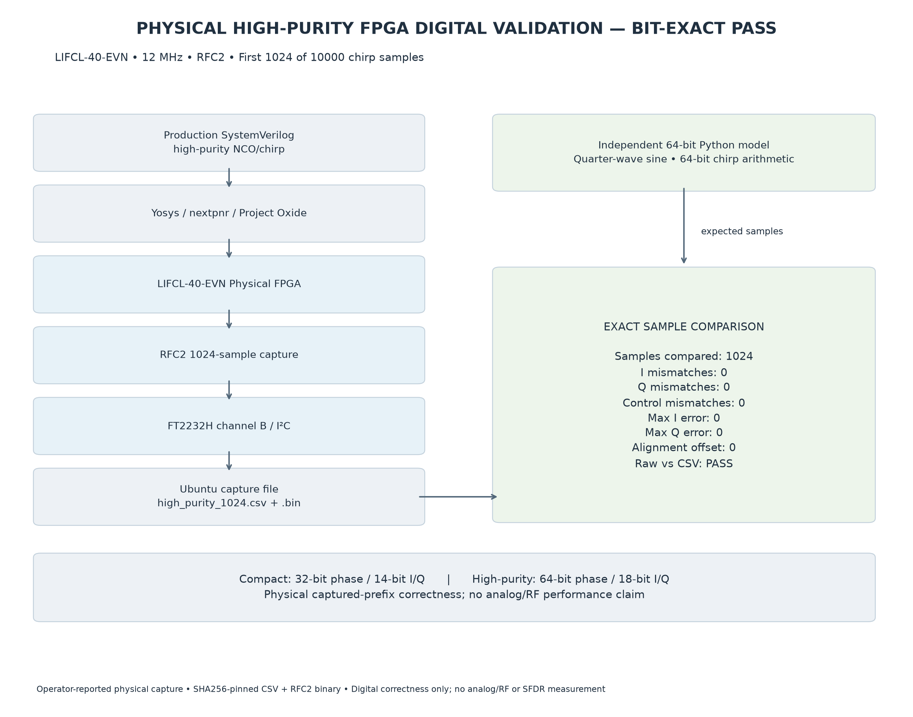

# High-purity physical digital validation

**PHYSICAL HIGH-PURITY FPGA DIGITAL WAVEFORM VALIDATION: BIT-EXACT PASS**

The operator manually programmed the high-purity image on LIFCL-40-EVN /
CrossLink-NX, observed D3 ON (capture done), D4 OFF (no error), and successfully
read 1024 RFC2 records through FT2232H channel-B I²C. JP2 was shorted and JP1 open.
Physical loading/readback provenance is operator-reported. The saved bytes were
independently compared offline; this comparison makes no hardware access.

## Preserved evidence

| Artifact | Bytes | Records | SHA256 |
|---|---:|---:|---|
| [Original CSV](../reports/hardware_capture/high_purity_1024.csv) | 25318 | 1024 | `d90676b2796dce1993dc3756796df85f03ddd10a45332cc22f80b871d2d3b52d` |
| [Original RFC2 binary](../reports/hardware_capture/high_purity_1024.bin) | 5136 | 1024 | `a330767ded866da6afb130b27300448921d562ead2fba65afed027f73783b964` |

The CSV has 1025 lines including its header. Original CRLF and binary bytes are
preserved with `.gitattributes`; neither capture is normalized or regenerated.
[Evidence manifest](../reports/high_purity_physical_verification/evidence_manifest.json)
and [comparison metadata](../reports/high_purity_physical_verification/comparison_results.json)
provide source hashes and detailed results. Compact evidence remains at its
[Milestone 4 public location](../examples/physical_capture/README.md), byte-identical.

The manually loaded `build/lifcl40/high_purity_capture.bit` remains local/generated.
Its SHA256 is `206f10e0fd0d69f60f4fae54c2ea8535497e5fe8818cf2dbf2cc27222277233e`.
Source/build scripts are published; generated bitstreams and bulk reports are not.

## Configuration and exact reference

The wrapper uses native 12 MHz, a 10000-sample one-shot chirp nominally 500 kHz to
2 MHz, start word 768614336404564651 and signed step +230607361657535. Production
mode has 64-bit modulo phase/word arithmetic, top 16 phase bits for lookup, a
quarter-wave ROM, signed 18-bit I/Q, and dither off. The independent Python model
computes sine mathematically; it never reads RTL LUT constants or fits captured
amplitudes. Rounding is nearest/ties-away, symmetric ±131071, I=cos and Q=sin.

After four reset edges, E0 accepts start without a sample, E1 admits phase zero,
E2 outputs sample 0 with valid/start, and E3 stores that pre-edge output at index
0. Thus comparison uses alignment offset **0**, with no offset search, tolerance,
normalization, or sample removal. See [architecture and RFC2 packing](high_purity_nco.md).

| Check | Result |
|---|---:|
| Samples | 1024 |
| I / Q mismatches | 0 / 0 |
| valid / chirp_start / chirp_end mismatches | 0 / 0 / 0 |
| Alignment offset | 0 |
| Maximum absolute I / Q error | 0 / 0 |
| RMS I / Q error | 0 / 0 |
| Raw RFC2 vs CSV | Exact agreement |

First record is `(0, 131071, 0, 1, 1, 0)`; last is
`(1023, 70186, 110695, 1, 0, 0)` in index/I/Q/valid/start/end order.
All samples are valid, only index 0 asserts start, and no captured sample asserts
end: the expected end at index 9999 is outside this prefix.

## Reproduction and scope

Follow the [offline verification commands](verification.md#milestone-5--5a-offline-reproduction).
The publication regression passes 87 tests, including Verilator RTL/capture
simulation. Both physical captures reproduce exactly. No FPGA rebuild, programming,
or hardware access was performed during the publication audit.

This establishes digital correctness of the tested 1024-sample prefix and RFC2
transport of full 18-bit I/Q. It is not an exhaustive proof of all configurations,
the uncaptured chirp tail, or an asserted end marker in hardware. The >90 dBc
numerical digital SFDR study is separate from this short physical chirp capture.
There is no measured analog SFDR, RF phase noise, DAC validation, GHz RF output,
400 MHz physical RF bandwidth, multi-lane hardware validation, or complete RF
signal-generator hardware claim.
