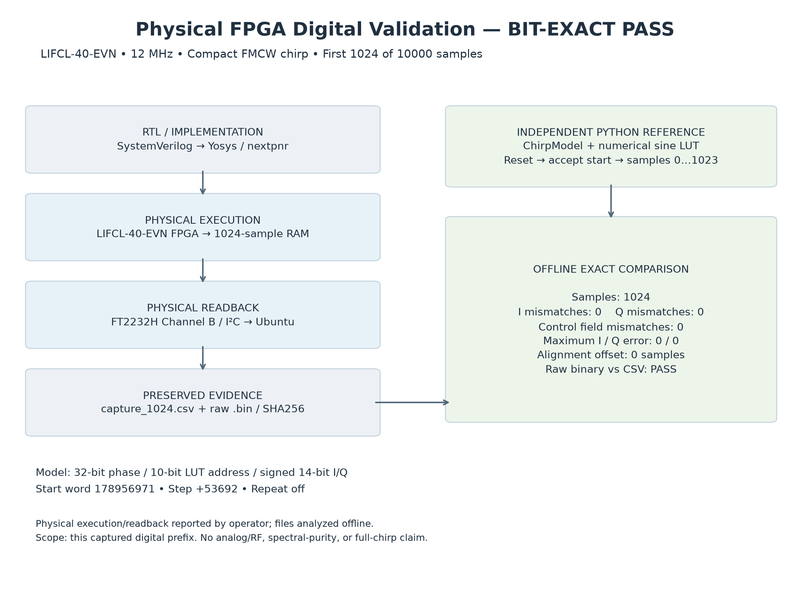

# Physical FPGA digital validation

**PHYSICAL FPGA DIGITAL WAVEFORM VALIDATION: BIT-EXACT PASS**

Milestone 4 established SRAM programming, static A/B LED behavior, native 12 MHz clock operation, chirp liveness, and physical digital sample readback on an LIFCL-40-EVN. Physical operation and readback were reported by the operator; the saved capture was compared offline against the independent Python model.

## Exact capture configuration

| Setting | Value |
| --- | --- |
| Implementation target | LIFCL-40-9BG400C |
| FPGA sample clock | Native 12 MHz, no PLL |
| Jumpers | JP2 shorted; JP1 open |
| Start phase-increment word | 178956971 |
| Signed chirp step | +53692 |
| Chirp length | 10000 samples |
| Repeat | Off |
| Initial phase | Zero |
| Capture | First 1024 consecutive valid samples |
| Numerical format | 32-bit phase, 10-bit LUT address, signed 14-bit I/Q |

The configured nominal sweep is 500 kHz to 2 MHz. Quantized endpoints are 500000.000931 Hz and 1999987.137504 Hz. Only the initial 1024 samples were physically captured, spanning 0–85.25 µs between first and last sample; the entire chirp has 10000 sample slots / 833.333333 µs.

Start acceptance emits no sample. The next enabled edge produces sample 0. Capture begins at the first `valid && chirp_start`, and stored markers describe the same registered I/Q cycle. Expected capture index 0 is Python sample 0. No alignment offset was introduced.

## Measured comparison

| Check | Result |
| --- | --- |
| Samples compared | 1024 |
| I / Q mismatches | 0 / 0 |
| valid / chirp_start / chirp_end mismatches | 0 / 0 / 0 |
| Records with any mismatch | 0 |
| Alignment shift | 0 samples |
| Maximum absolute I / Q error | 0 / 0 codes |
| RMS I / Q error | 0 / 0 codes |
| Raw binary vs CSV | Exact match |

All indices are continuous from 0 through 1023; all samples are valid. The first record is I=8191, Q=0, valid=1, chirp_start=1, chirp_end=0. Exactly one start marker appears. Every end marker is zero, as expected for a prefix of a 10000-sample chirp. SHA256, sizes, and reproduction commands are in the [included capture README](../examples/physical_capture/README.md).

## Capture and transport

The wrapper uses 1024 × 32-bit frozen capture RAM (32768 bits, two EBRs). FT2232H channel B provides 25 kHz MPSSE I²C readback at seven-bit address `0x2A`; a two-byte big-endian address pointer selects the byte offset. The host reads the image twice and rejects disagreement before saving. The reader's “no numerical correctness claim” message correctly distinguishes transport success from the separate exact comparison.

RFC1 consists of a 16-byte header and 4096-byte payload. Header bytes: 0–3 `RFC1`, 4 version=1, 5 status=1 (complete, no error), 6–7 little-endian count=1024, 8 bytes/record=4, 9 I/Q width=14, 10–15 zero. Each four-byte little-endian record packs signed I in bits 13:0, signed Q in 27:14, valid in 28, chirp_start in 29, chirp_end in 30, and reserved zero in 31. Indices are implicit.

Board pins: L13 clock, F20 SCL, E20 SDA, E17 D3, F13 D4; all use LVCMOS33. SDA is open-drain. D3 ON means capture complete; D4 ON means error. The build explicitly disables configuration-port persistence on the shared pins and audits the packed configuration.

The historical complete capture build used 349 COMB, 155 fabric FF, 3 EBR, and 0 DSP. nextpnr estimated Fmax 198.93 MHz and +78.31 ns internal setup slack at 12 MHz. These are wrapper-specific implementation estimates, not measured maximum hardware frequency or external I²C timing guarantees.

## Scope

This establishes exact digital waveform agreement for the saved physical prefix. It does not measure analog DAC performance, RF phase noise, GHz output, 400 MHz physical RF bandwidth, high-purity operation, or every possible configuration. Original working evidence and internal debug reports are retained locally; selected copies and public summaries are published here.
