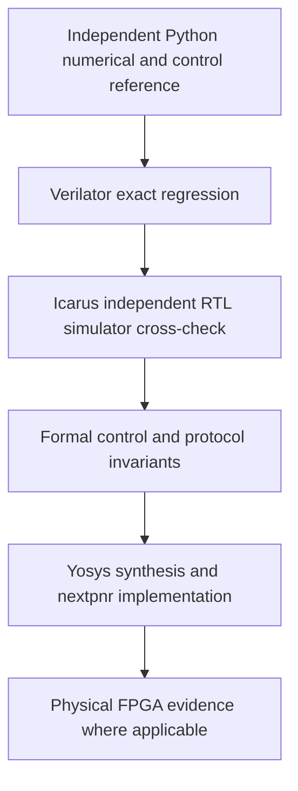

# Verification and signoff policy

open-rf-ip does **not** treat Verilator alone as design signoff. Software selects
waveform parameters; dedicated RTL determines every sample and its timing. A
verification change must preserve that numerical contract.



These checks provide different evidence, rather than replacing one another:

| Layer | Role and limits |
|---|---|
| Python | Independent mathematical and behavioral reference; no reference changes to accommodate an RTL failure. |
| Verilator | Fast cycle-exact regression and long waveform comparisons; two-state simulation cannot establish full four-state behavior. |
| Icarus Verilog | Independent execution of RTL simulation semantics. A different Verilator configuration, synthesis or formal solver does not qualify. |
| Formal | Protocol and configuration safety across arbitrary input sequences under stated assumptions. Proof scope excludes waveform arithmetic and ROM contents. |
| Yosys / nextpnr | Synthesizability, resource use and routed timing for the particular source and harness. |
| Physical FPGA | Physical digital claims require preserved captures and exact independent comparison. Simulation of a control interface is not physical control-interface validation. |

## Required practices

- Use strict Verilator `--Wall`. Unsupported constructs must fail. No undocumented
  warning suppressions and no simulation-changing unsupported-feature blackboxing
  (including `--bbox-unsup` or `--bbox-sys`) are permitted for signoff.
- Preserve the fast, deterministic ordinary regression. For control/SoC signoff,
  additionally run randomized initialization and reset stress with recorded seeds.
  Do not use `--x-initial fast` or `--x-assign fast` in that campaign.
- Compare I/Q, valid and chirp markers exactly with the independent models: no
  tolerance, normalization, alignment search or best-fit correction.
- Cross-simulate critical control interfaces with identical stimuli and compare
  public observations exactly. Missing tools are an unexecuted gate, never a pass.
- Formally prove practical protocol/control invariants, state assumptions, and
  require reachable covers. Report bounded checking separately from induction.
- Preserve every failure before classifying it as RTL, simulator, tool-support,
  testbench, reset, or formal-modeling behavior. A production RTL bug blocks
  signoff and requires a separate authorized correction.
- Preserve hashes of source and physical evidence. Never regenerate a saved
  physical capture to make it agree with a reference.

## Offline entry point

From the repository root, with the existing Python environment and tools:

```sh
.venv/bin/python scripts/run_verification_signoff.py
```

Stages can be selected with `--stage tools`, `hashes`, `baseline`, `lint`,
`randomized`, `cross`, or `formal`. A selected stage is not full signoff. The
complete entry point returns nonzero if any required gate fails. Detailed logs,
JUnit results, vectors, transcripts, proof scripts and JSON summaries remain
local under `reports/verification_hardening/`; build products are under `build/`.
No stage installs tools, accesses hardware, programs an FPGA, or writes capture
files. Run from the root because the established Python tests use that convention.

The source/evidence audit is anchored to the frozen Milestone 6 commit
`9b853ad1b9596229859ed35ae2ce5324b7ba891f`. It compares all 151 previously tracked
files, including RTL, numerical models, ROM sources and published captures. A
fresh clone reconstructs the baseline hashes from that Git object; an existing
snapshot is never silently replaced. HEAD may be the baseline or a descendant,
so committing verification-only additions does not invalidate the runner. All
151 frozen-file hashes still have to match. A future milestone must explicitly review
and update the baseline policy rather than bypass a failed audit.

## Randomized initialization and reset

For installed Verilator 5.032, the local manual documents:

```text
build:   --Wall --x-initial unique --x-assign unique
runtime: +verilator+rand+reset+2 +verilator+seed+N
```

`unique` selects runtime initialization, reset mode `2` randomizes it, and `N`
selects a reproducible Verilator seed. The cocotb random seed is also recorded;
setting only cocotb's seed would not randomize RTL initialization. Each run is a
new simulator process. A public pre-reset output is recorded only as evidence
that initial state varies; it is never an expected architectural value.

The campaign uses seeds **61101–61110** on all four standalone CSR configurations
(compact/high-purity × tone/chirp) and **61101–61103** on each controlled chirp.
Every run executes the documented synchronous reset before checking behavior.
The existing 10,000-sample chirp test retains its independent Python reference.

Additional reset scenarios cover idle, dirty shadow, immediately after LOW/HIGH,
a captured COMMIT canceled by reset before execution, immediately after COMMIT,
busy operation, paused busy operation, RUN_ENABLE low, sticky errors/completion,
and four repeated reset/deassert sequences. Every post-reset register is read
through Wishbone; active outputs, flags and waveform edges are checked against
the independent model. Reset does not acquire a new meaning in this campaign.

The existing waveform scoreboard also observes internal phase. The legacy
standalone CSR test deposits the sequence counter to test rollover. Those VPI
operations are confined to the established Verilator tests; the portable replay
uses public ports only. No asynchronous edge-emulation option is needed for the
single-clock, synchronous-reset contract.

## Independent simulation boundary

The common replay instantiates `openrf_control`, including the unchanged Wishbone
adapter and CSR core, for both compact and high-purity chirp profiles. It uses a
versioned JSON transaction source generated by
`verification/signoff/transactions.py`. The same cocotb replay runs against
Verilator and Icarus when both are installed; it never deposits internal state.

There are 94 directed transactions and five seeded extensions, each containing
500 additional transactions. Seeds are **61201–61205**. Directed traffic includes
identification, byte selects, LOW/HIGH pairs in both orders, valid and invalid
COMMIT/START, busy rejection, dirty rejection, compact extension validation,
unsupported mode, partial/multiple commands, reset, misalignment, unmapped access,
RO writes and status clear. Random traffic contains legal and illegal accesses,
resets, engine busy and completion inputs. These engine inputs are intentionally
synthetic at the control-block boundary.

Every clock edge records the public request, ACK/ERR/read data, active
configuration, run/valid/start, and engine inputs. STATUS, ERROR_STATUS and
CONFIG_SEQUENCE are sampled through actual bus reads after each transaction.
The existing independent Python control model also checks the execution edges.
Both transcripts must match exactly, including cycle numbers. The first mismatch
index is recorded and both full transcripts retained.

**Milestone 6.1A result: PASS.** Icarus Verilog and vvp 12.0 (stable) execute
the same replay as Verilator 5.032. Both directed profile comparisons and all ten
randomized profile/seed comparisons match exactly: 12 comparisons of 24 simulator
transcripts, using seeds 61201–61205. No tolerance, ignored fields or simulator-
specific expected-value path is used. The first attempt was blocked solely by
Icarus being unavailable; the user installed it and the complete flow now passes.

Cross-simulation covers the Wishbone/CSR boundary, not the full waveform datapath.
No simulator-specific RTL workaround or warning suppression was added for this
boundary. Exact transcript agreement holds for the tested configurations; other
simulator versions and full waveform cross-simulation are not claimed. Numerical
waveform comparisons remain in the Verilator/Python layer.

The open-rf-ip control and waveform verification flow no longer relies on
Verilator as a single simulation authority: randomized-reset testing,
independent Icarus cross-simulation, formal control-plane properties, exact
Python reference comparison, synthesis checks and preserved physical
evidence form the verification stack.

## Formal boundary and assumptions

The formal harnesses are under `verification/formal/`; the runner uses installed
Yosys 0.52's built-in SAT engine because SymbiYosys and external SMT solvers are
absent. It does not blackbox any cell or ignore unsupported SAT cells.

Each SAT step represents a rising edge of the single clock. The only environment
assumption is reset on the first edge. Later resets, requests, addresses, write
data, byte enables, busy and completion inputs are arbitrary. In particular,
COMMIT and START are not assumed absent or successful. Wishbone inputs may even
abort; the bounded response obligation applies when CYC/STB remain asserted.
There is no fairness assumption about an external engine completing.

The Wishbone harness checks exclusive ACK/ERR, no response when request/reset
gating disallows it, one execution event at B, registered response latency,
no duplicate response, captured payload, read/error data and reset state. Its
small transaction-phase monitor has a total transition relation for induction.
The CSR harness separately proves address/access error decoding, so misaligned,
unmapped and RO-write rejection compose with the adapter's captured request and
registered error response.

CSR assertions apply to both profiles and both engine kinds. They check the
complete active tuple (all three 64-bit words, length and repeat), byte writes,
reset, dirty/valid/sequence, exact START qualification, error persistence and
rejection bits, completion/clear priority and RUN_ENABLE. The active tuple must
hold on **every** edge except reset or successful COMMIT; successful COMMIT must
publish the entire pre-edge shadow tuple. This also covers partial writes,
either write order, busy/invalid commits, status clear and runtime-control writes.
Compact step validity is expressed as a signed mathematical range, alongside
zero unsigned high words. No assumptions restrict high-purity 64-bit values.

Proof-only observer wires are connected after elaboration to the existing shadow
and status state with `connect -nomap -nounset`; no DUT driver is cut or replaced.
`check -assert` rejects undriven observers. Yosys `async2sync` lowers clocked
assertions before `chformal -lower`; the production design has no asynchronous
reset elements to transform. These are verification-netlist operations only.

Reachability goals include COMMIT, sequence advancement, START in chirp builds,
dirty START rejection, busy COMMIT rejection, error followed by clear, and each
64-bit pair in both write orders. Tone builds intentionally have no valid START
cover. SAT witnesses are required for every selected goal, not just a disjunction.
Exact proof depth, induction results, property counts and cover witnesses are
recorded in the milestone report and `formal_results.json`. Formal claims apply
only to these assertions and assumptions, not to the complete waveform engine.

## Build performance and warning audit

The existing runners use flat cocotb/Verilator builds, generally `--Wall`, with
optional FST tracing on selected tests. They do not explicitly request output
splitting, hierarchical Verilation, X options, blackboxing or warning suppression.
No project-level ccache setting was present. Installed Verilator's make rules
support `OBJCACHE`; the signoff runner sets it locally when ccache is available
and puts the cache inside `build/verification_hardening/ccache`.

Installed Verilator supports `--output-split`, `--output-split-cfuncs`,
`--output-split-ctrace`, `--output-groups`, `--hierarchical` and build-job controls.
For future large CPU simulations, measure clean and incremental build time,
memory and cache hit rate before choosing splitting or parallelism. Reuse built
models across runtime seeds now. No architectural restructuring or speedup claim
is justified by this review.

Verilator's installed C++ make rules contain their own compiler warning flags;
these are not RTL lint suppressions introduced by this project. Repository RTL
lint remains strict and unsuppressed. Tool versions are recorded in
`tool_versions.json`; equivalent behavior on untested versions is not implied.
